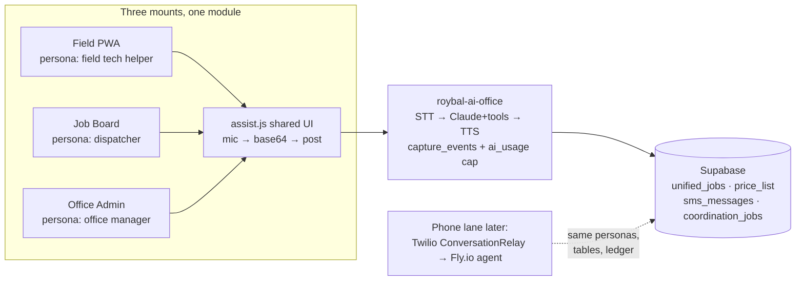

# Voice Assistant Integration Plan — One Assistant, Three Mounts

*How the voice-conversation virtual assistant rolls out across the Field app, the
Job Board, and the Office Admin app — and how the Twilio phone receptionist joins
later without rebuilding anything.*

**Date:** July 17, 2026 · **Status:** approved plan, not yet started
**Method:** 7-reader codebase recon → 3 independent designs → 3-lens judging
(feasibility / sequencing / ops-risk, unanimous winner) → completeness critique.
Companion doc: [AI_Assistant_Roadmap.md](AI_Assistant_Roadmap.md) (the business-level
phases; this plan is the engineering map for its Phases 0–3 assistant work).

---

## The thesis

The field app already ships a complete, proven voice assistant — **"Ask the
Office"** (`apps/field/js/assist.js` UI + `apps/field/js/officeai.js` transport +
`roybal-ai-office` edge function doing Deepgram STT → Claude → Aura TTS, with the
capture_events-first ordering, ai_usage ledger, and $50/mo cap). **We do not
rebuild any of it.** We generalize its two field-only coupling points (the job
context digest and the session key) into an injected *provider*, add a per-app
persona map server-side, and mount the identical module in `/board` and `/admin`
using the cross-app import convention the repo already uses everywhere
(`../../js/*` resolves because `deploy-field.yml` composes field at the site
root — the same mechanism board already uses for `supa.js`/`qbtime.js`).

No build step. No new infrastructure until the phone lane. Every phase ships
alone and is useful alone.

## Per-app integration map

| | Field (baseline) | Job Board (Phase 2) | Office Admin (Phase 3) |
|---|---|---|---|
| Mount point | `app.js:130` `mountAssist(project)` (unchanged) | `board.js` `startUI()` after sign-in | `admin.js` `boot()` after `isSignedIn()` |
| Context digest | `narrativeFacts`/`constructionFacts` + estimator follow-ups (as today) | `computeCfoSnapshot()` + compact per-job rows + pre-computed `findOverAllocations`/`freeThatDay` | `Store.all()` via shared IndexedDB → `jobSummary()`/`jobAttention()` + `qboStatus()` + unread portal count |
| Persona | field tech helper (existing `ASSIST_SYSTEM`) | dispatcher/scheduler voice | office-manager/estimator voice |
| v1 sample asks | "what's left before this job is billable" | "who's free Thursday", "what's slipping" | "which jobs need attention", "any customer messages waiting" |
| New files | none | `apps/board/js/assistctx.js` | `apps/admin/js/assistctx.js` |

Board and admin providers live **outside the field module graph**, so no
`sw.js` CORE additions are needed for them (board/admin have no service worker).
Note: `apps/board/index.html:15` already links `../css/app.css`, which contains
the `.assist` styles — no CSS work needed for either mount.

## The voice pipeline (reused, then polished)

The shipped turn-based loop serves all three apps unchanged: MediaRecorder
(audio/mp4 preferred, 250 ms timeslice — load-bearing on iOS) → base64 POST with
≤12 prior turns + context digest → server does capture_events insert → cap check
→ Deepgram nova-3 STT → Claude → Aura TTS → `{transcript, reply, replyAudio}` →
single gesture-unlocked Audio element, hands-free re-arm on playback end.
Latency ~3–6 s per turn — fine for an in-app colleague, **not** for a phone
caller, which is why the phone lane gets a different transport instead of
bolting streaming onto the edge function.

**Polish pack (Phase 1b, all client-side, no infra):**
- VAD auto-endpointing in hands-free mode (WebAudio AnalyserNode, ~800 ms silence stop)
- `getUserMedia` constraints: echoCancellation, noiseSuppression, autoGainControl (truck cabs)
- Earcons (listening / thinking / done) + 64 px glove-size mic targets
- Speak-mode brevity: when `speak` is true, append a ~2-sentence spoken-answer rule; trial Haiku 4.5 for voice turns (latency + cost)
- Deepgram keyterm boosting for trade vocabulary ("LGR", "dehu", "cat 3", "antimicrobial") — one query param on `sttTranscribe`

If in-app latency still hurts after Phase 3, the documented escape hatch is
SSE sentence-chunked streaming on the existing edge function — a decision
point, not a committed phase.

---

## Phases

### Phase 0 — Surface the inbound SMS thread (S) — *independent pre-work*
Inbound texting went live July 17 but **no app UI reads `direction='inbound'`
rows** — replies log to `sms_messages` and optionally forward to a phone, and
that's it. Before the assistant can be smart about conversations, humans need
to see them:
- [ ] Field job page Message log: merge inbound rows (matched by `unified_job_id`, fallback phone match) into the existing log with direction styling
- [ ] Admin: same thread view at the office level
- This completes the roadmap Phase-1 checkbox "office sees customer responses in the Message log" and gives Phase 4's `smsThread` tool a human-visible counterpart.

### Phase 1 — Extract the seam + fix the meter (S)
- [ ] `assist.js`: provider object (`key/title/greeting/app/buildContext/unifiedJobId/capturedBy`); `mountAssist(p)` becomes a thin field-provider wrapper. Note: the greeting is computed inside `paintMessages()` from `jobType(project)` and `transcript()` closes over the module-level project — the seam must reach both, not just `mountAssist`.
- [ ] `officeai.js`: `fieldAssist` tolerates a null project; payload gains `app` (persona key). Keep `fieldAssist` action name as a back-compat alias — cached PWA clients lag edge deploys by days.
- [ ] `roybal-ai-office/index.ts`: `PERSONAS` map (field = existing `ASSIST_SYSTEM`; board; admin), selected by `body.app`, **server-defined text only**; field default.
- [ ] **Metering fix** (spend currently under-reports the $50 cap):
  - STT seconds → existing `audio_seconds` + `stt_cost_usd` columns for **both** `fieldAssist` voice **and** `transcribeOnly` dictation (today that path pays Deepgram, reports `{0,0}`, and mislabels provider); correct provider labels to `deepgram` / `deepgram+anthropic`.
  - TTS at **$0.03/1k chars** (the code's own rate, not the 1.5¢ folklore) → tiny additive migration `203_ai_usage_tts.sql` adding `tts_chars`, `tts_cost_usd`.
  - App attribution written into **both** the initial `capture_events` insert **and** the success-path `raw_payload` patch (the success path rewrites `raw_payload` wholesale — a stamp only on insert survives only on failures).
- [ ] `sw.js`: CACHE bump (no new field-graph files).
- [ ] Field regression checklist before Phase 2: chat / voice ask / hands-free / photo ask / dictation / cap toast — identical behavior.

### Phase 1b — Truck-cab polish pack (S)
The five polish items above. Ships alone; makes hands-free feel like a
conversation before the new mounts land.

### Phase 2 — Board mount (S)
- [ ] `apps/board/js/assistctx.js`: provider over `computeCfoSnapshot(cachedJobs(), cachedCrew(), settings, todayISO())` + trimmed per-job rows (id/name/stage/dates/crew only, cap ~50 jobs) + pre-computed availability answers — v1 needs **zero server tools**.
- [ ] `board.js`: one import + one `mountAssistProvider()` in `startUI()`; FAB/drawer live on `document.body` so the wholesale `#view` re-render and 20 s poll never touch them.
- [ ] `capturedBy: "board"`, `unifiedJobId: null`.

### Phase 3 — Admin mount (S)
- [ ] `apps/admin/js/assistctx.js`: office digest from shared IndexedDB (`Store.all()` → `jobSummary()`/`jobAttention()`), `qboStatus()`, unread `portal_messages` count (query exists at `portal.js:168`).
- [ ] `admin.js`: import + mount in `boot()`.
- [ ] Fix stale "Roybal Restoration" title in `apps/admin/index.html` (rebrand miss).
- [ ] Job answers deep-link via existing `openJob()` → field `#/p/<id>`.

### Phase 4 — Server read tools (M) — ✅ SHIPPED Jul 18 2026 (v45)
`chatWithTools()`: bounded tool-use loop (≤2 rounds, then the model must
answer), `monthSpend` re-checked between rounds, cumulative usage rides
thrown errors onto the ledger. All tools RLS-scoped via `db()` with the
caller's JWT — never a service key. Tool failures return `{error}` to the
model instead of failing the turn.
- [x] `priceLookup` — word-match search over `public.price_list` (ilike, sanitized), category filter, 15-row cap
- [x] `jobLookup` — `unified_jobs` by claim/name/address
- [x] `boardRead` — `coordination_jobs` stage/dates/crew names (jsonb envelope unwrapped)
- [x] `smsThread` — `sms_messages` both directions, optional phone filter: "did the customer text back?"
- [x] `hoursLookup` — `time_entries` aggregates by job + crew since N days (manual board entries; QB Time daily-pull still the gate for full coverage)
- [x] Personas + tool schemas + per-app toolsets extracted to `supabase/functions/roybal-ai-office/personas.ts` *(inside the function dir rather than `_shared/` so the MCP two-file deploy bundles it; the phone agent imports the same repo path later)* — all three personas share all five read tools today; the phone persona will get a narrow set

### Phase 5 — Confirmed actions: chips, not autonomy (M) — ✅ SHIPPED Jul 18 2026 (v46)
`proposeActions` tool (registry: `ACTION_DEFS`/`ACTIONSETS`/`ACTION_RULE` in
`personas.ts`) → replies carry `proposedActions[]` → `assist.js` renders
tap-to-confirm chips; execution is the provider seam's `executeAction(action)`
so each app runs its own guarded paths. Nothing executes without the tap.
- [x] **Prerequisite: quiet-hours guard in `roybal-notify`** — `assertSendWindow()`: customer-facing kinds blocked outside 8am–8pm America/Anchorage (`SMS_QUIET_START/END` overridable); crew kinds (`fieldReport`, `forward`, chip-confirmed `assistCrew`) exempt; unknown kinds guarded by default
- [x] SMS chips (all apps) → field: `runFieldAction` (logs `smsLog` kind `assist`/`assistCrew` + company lane + Messages fallback); board/admin: shared `assistSend()` in `sms.js`. A `quiet_hours` refusal never falls back to the device link — that would sidestep the guard.
- [x] Board chips → new `apps/board/js/actions.js`: `moveJob` (pin `scheduleMode='manual'`+`pinnedStart`, `computeSchedule` reflow, persist every moved job via guarded `saveJob`), `logHours` (`saveTimeEntry`); exact-match-beats-ambiguity job/crew matching; board `refresh()` repaints on execution
- [x] Admin chips: `adjusterEmail` (draft + clipboard, nothing emailed), `portalReply` → `portalDraft` draft in-thread with a SECOND confirm chip (`portalPost` → `sendOfficeReply`) before anything reaches the customer, `sendText`. No project mutations from /admin.
- [x] Field chips: `sendText` (job-scoped, logged as claim documentation). *Form write-backs deliberately deferred — the voice-capture chip path already covers form-scoped capture; mapping free chat onto form instances is a separate design (revisit post-Phase 6).*
- [x] **Audit trail**: chip execution patches the originating capture_event (`result.executed[]` — type/label/ok/detail/at, best-effort) and SMS sends land in `sms_messages`/`smsLog` as before
- [x] Feedback loop: chip outcomes queue per provider and ride the next turn as `body.actionResults` → surfaced to the model as CHIP RESULTS in the user turn (client history is text-only, so wire-level `tool_result` blocks can't survive turns)

### Phase 6 — Phone lane: the virtual receptionist (L) — 🚧 BUILT Jul 18 2026, awaiting owner deploy steps
Code complete + tested (7/7 agent tests, fake Twilio client over a real
WebSocket): `services/phone-agent` (Fly.io Node agent — streaming Claude loop,
phone persona + PHONE_TOOLS from the registry, machine JWT, envelope + metering
+ voice-minutes cap, per-call/per-caller rate limits), `roybal-voice` edge fn
(signature-verified: Dial-owner-first no-answer forwarding → ConversationRelay
TwiML → /action handoff: escalate-Dial / voicemail), migration 204 (restrictive
deny RLS for the machine email — applied). **Owner steps to go live are in
`services/phone-agent/README.md`**: create the machine user, Fly launch +
secrets, edge-fn secrets (PHONE_AGENT_WSS / PHONE_RELAY_TOKEN / OWNER_CELL),
point the Twilio Voice webhook at roybal-voice. Original design (kept):
Twilio Voice webhook on **+1 (866) 345-2290** → TwiML
`<Connect><ConversationRelay>` (Twilio does streaming STT/TTS + barge-in) → a
small always-on Node agent on Fly.io → Claude.
- Rollout: **no-answer forwarding first** — the AI only takes calls that would have been missed
- **Day-one resilience**: TwiML failure fallback to voicemail / forward-to-owner-cell, so a Fly hiccup never dead-ends a customer call
- Same brain: imports `_shared/personas.ts` (phone = 4th persona); runs `apps/board/js/schedule.js` server-side for real availability (it's pure ESM — add a comment guard declaring it server-shared the day the agent imports it)
- Auth: dedicated Supabase machine user (creds only in Fly secrets) → password-grant JWT → everything RLS-scoped as `authenticated`; **JWT-as-truth** — the handler enforces the machine user's tool whitelist from the JWT email claim, never from `body.app`; defense-in-depth RLS policies deny UPDATE on `coordination_jobs`/`field_projects` for that email while allowing lead INSERT
- Per-caller rate limits on `create_lead`/`text_owner` — bounds a prompt-injecting caller to one junk lead and one SMS
- Same envelope: `capture_events` (`source_type 'phone_call'`) before paid work, `ai_usage` after; phone minutes ride the $50 cap + a new voice-minutes cap env var
- New-loss intake → `coordination_jobs` lead blob (stage `lead`, rev initialized, flagged "AI-booked") + owner SMS; caller-ID → job match via `unified_jobs`
- Emergency escalation: active water loss → live transfer to owner's cell + urgent text
- If transcripts persist: explicit retention stance (working chatter, ~30-day scope, owner purge control)

---

## Rulebook (every phase must respect)
1. No AI keys in clients — everything through edge functions; anon key + caller JWT; RLS applies.
2. `capture_events` insert **before** any paid call; `--no-verify-jwt` + in-function CORS invariant.
3. All AI spend in the `ai_usage` ledger under `SPEND_CAP_USD`; capped responses surface, never retry.
4. Online-only enhancement: offline/signed-out degrades to a toast, never blocks manual entry.
5. New field-graph files → `sw.js` CORE + CACHE bump, or PWA devices break offline. (Board/admin files are exempt — no SW.)
6. Cross-app imports (`../../js/*`) only resolve in the composed layout — test via `serve.mjs` or the deployed site.
7. Board writes only through `guardedJobWrite`; brand chrome navy `#0f1b2d` + orange `#f26a21`.
8. Deliberate exclusion: the assistant **never mounts on the customer portal origin** — privacy by construction.

## Cost picture
Phases 0–5: **zero new infrastructure**. Per-turn: text ~1–2¢, voice ~2–4¢
(STT ~0.1¢/15 s + TTS ~1.2¢/400 chars at the real $0.03/1k rate), tool turns
~3–5¢. At 30–60 turns/day: **$20–60/mo worst case**, governed by the cap —
which is exactly why the Phase 1 metering fix ships first (today voice
under-reports). Phase 6 adds Fly ~$5/mo + ~10–15¢/min voice; a 5-minute intake
≈ 60¢. Steady state with receptionist: **$30–80/mo**.

## Top risks
1. **sw.js precache footgun** — mitigated by keeping new files outside the field graph.
2. **Refactor regression in the one shipped assistant** — mitigated by the unchanged `mountAssist(p)` contract + the Phase 1 regression checklist.
3. **Board context token bloat** — trimmed rows, ~50-job cap.
4. **Scope creep toward streaming** — resist; streaming is the phone lane's job.
5. **Metering jump** — expect measured spend to rise (correctly) when Phase 1 lands.

## Update when shipping
- `AI_Assistant_Roadmap.md`: check off Phase 1 items (Twilio went live 2026-07-17), map its Phase-2 automated notifications relative to this plan (shared lane: `roybal-notify` + templates; they can ship any time after this plan's Phase 0), note QB Time daily-pull as the timesheet-nudge gate.
